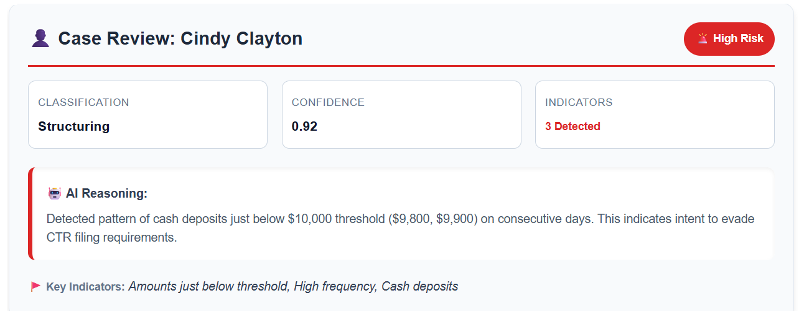

# Complete System Demonstration

This log stems from a run of "🏁 Step 6: Complete System Demonstration" from the `03_workflow_integration.ipynb`notebook.

## Custom UI

Based on reviewers feedback, I have implemented a simple UI, that becomes visible during the interactive runs in the 
notebook.



## Log
```
[...]
✅ APPROVED
   📝 Logged decision 'APPROVE' to audit trail.
📝 STAGE 2: Compliance Narrative Generation
   ⚠️ Real Compliance Agent Failed (Failed to parse Compliance Officer JSON output: Er...). Switching to Mock...
   ✅ Mock Narrative Generated
📄 Creating SAR Document
    💾 Saved to: ../outputs/filed_sars/SAR_e774efcf-3adf-451b-8f4d-69bded2f6502.json
✅ SAR FILED SUCCESSFULLY: SAR_e774efcf-3adf-451b-8f4d-69bded2f6502

⏳ Pausing 2 seconds for review...
📊 Workflow Efficiency Analysis
📋 TODO: Calculate processing metrics
📈 WORKFLOW METRICS:
   Total Cases Processed: 3
   SARs Filed: 2
   Cases Rejected: 1
   Approval Rate: 66.7%
   Rejection Rate: 33.3%

💰 COST OPTIMIZATION:
   Two-stage processing saves costs by only running
   expensive compliance generation on approved cases
   Cost savings: 33.3% of compliance calls avoided

📈 PROCESS METRICS:
   Total Cases Screened:    3
   Proceeded to SAR:        2
   Rejected at Gate:        1
   Rejection Rate:          33.3%

💰 COST OPTIMIZATION (The 'Why'):
   The Two-Stage workflow filters low-risk cases before the expensive
   narrative generation step.
----------------------------------------
   Theoretical Cost (Single Stage): $1.80
   Actual Cost (Two Stage):         $1.35
----------------------------------------
   💵 TOTAL SAVINGS:                $0.45
   📉 COST REDUCTION:               25.0%

✅ SUCCESS: Cost optimization demonstrated. 1 expensive compliance calls avoided.
🎉 System demonstration complete!
📄 SAR documents saved to: ../outputs/filed_sars/
📊 Audit logs saved to: ../outputs/audit_logs/
```